<p align="center"></p>

# MLB Booth

Deep live MLB for the Omarchy bar. Pick any of the 30 clubs. Between games the
pill counts down to first pitch; during one it reads like the booth's
scorecard: score, half inning, count, and outs, refreshed every 20 seconds
from the same GUMBO feed MLB's own Gameday runs on.

```
ATL @ CWS 1h 05m              before the game
ATL 1-0 · T4 · 2-2, 0 out     during it
ATL W 4-2                     after it
```

[](https://ko-fi.com/U5S225PTME)

## Install

```bash
omarchy plugin add https://github.com/jeremylongshore/omarchy-mlb-booth-entry --enable
```

Then add **MLB Booth** to your bar layout (Omarchy menu, Bar, or
`~/.config/omarchy/shell.json`) and pick your team in its settings.

## Remove

```bash
omarchy plugin remove io.github.jeremylongshore.mlb-booth
```

## The panel

Click the pill:

- **Line score** by inning with R H E, plus bases, count, the live matchup,
  and the last play as the scorer described it. Extra-inning games show
  their trailing nine.
- **Schedule** for the coming week in your local time.
- **The division race**, your club bolded.
- **The Booth** (optional): two or three sentences of storyline between
  games, written by any OpenAI-compatible model you point it at. Off by
  default; the widget is complete without it.

## Data

Everything live comes free and keyless from the MLB Stats API
(statsapi.mlb.com): the schedule endpoint with team and line-score hydration,
the GUMBO live feed per game, and the standings endpoint. No account, no
token, no scraping.

| Feed | Cadence |
| --- | --- |
| Schedule + standings | every 15 minutes |
| GUMBO live feed | every 20 seconds, only while a game runs |
| The Booth recap | once per game-state change, never during live play |

Rain delays, postponements, suspended games, and doubleheaders are handled:
a delayed start holds the pill instead of collapsing it, a postponed game
never masquerades as a 0-0 final, and game two of a doubleheader never
renders game one's innings. How network input is contained is in
[SECURITY.md](SECURITY.md).

## Settings

One setting matters: **Team**, an enum of the 30 club abbreviations.

The Booth takes three more values, and three is the floor for
bring-your-own-key: which server, which model, which key. They are not in
the settings form; set them on the widget's entry in
`~/.config/omarchy/shell.json`:

```json
{ "id": "io.github.jeremylongshore.mlb-booth", "team": "ATL",
  "aiBaseUrl": "https://api.openai.com/v1", "aiModel": "gpt-4o-mini",
  "aiApiKey": "sk-..." }
```

The base URL must be https. Leave the three empty and the widget stays
fully keyless.

## Why not the existing scores plugin

The multi-sport scores widget is wide: every league, one line per game. MLB
Booth is narrow and deep: one club, the full in-game state (count, outs,
bases, last play), the division race, and an optional voice in the booth.
Follow one team all season and you want the scorecard, not the ticker.

## Development

```bash
npm test
```

The data layer (`Model.js`) is pure functions and loads in both Quickshell
and node; fixtures under `tests/fixtures/` are real API bodies captured
during a live game. Built from
[omarchy-widget-template](https://github.com/jeremylongshore/omarchy-widget-template).

## License

MIT.
